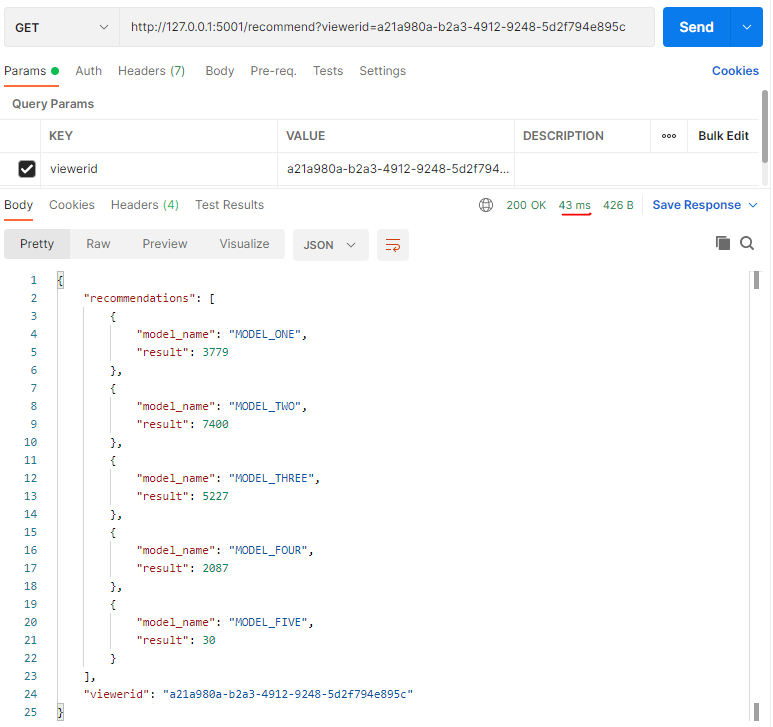
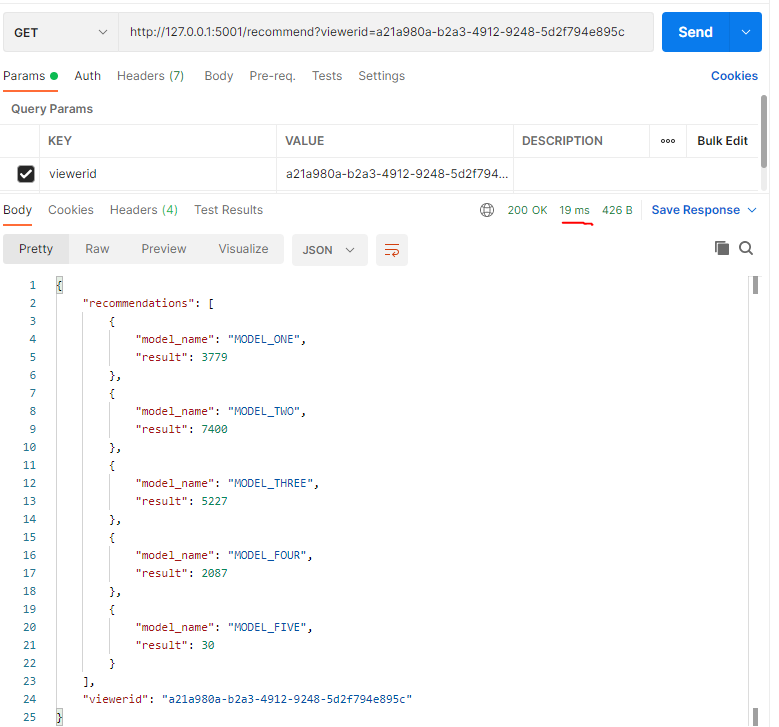

## Deployment
To prepare for further deployment build containers from 'generator' and 'invoker' folders.
### Redis
```shell
docker run --name redis -p 6379:6379 -d redis
```
### Generator App
```shell
docker run --name generator -p 5000:5000 -d generator
```
### Invoker App
```shell
docker run --name invoker --link generator:generator --link redis:redis -p 5001:5000 -d invoker
```

The set of commands listed above runs three docker containers and maps names for each of them. That will help in further service discovery. 

## Execution example

In the example below we will illustrate how endpoint could be accessed and what it returns with timing.
First part will show how endpoint could be triggered from command line via cURL command.
Second one will illustrate the same process from Postman. Both methods will be extended with time of execution for already cached values and not.

### Shell example
```shell
Valerii@DESKTOP-9R5T4FK MINGW64 /
$ curl -s -w 'Total: %{time_total}\n' -p http://127.0.0.1:5001/recommend?viewerid=ac378be5-1a76-481d-adb9-01aedaf1da0f
{"recommendations":[{"model_name":"MODEL_ONE","result":4922},{"model_name":"MODEL_TWO","result":388},{"model_name":"MODEL_THREE","result":7864},{"model_name":"MODEL_FOUR","result":3303},{"model_name":"MODEL_FIVE","result":1988}],"viewerid":"ac378be5-1a76-481d-adb9-01aedaf1da0f"}
Total: 0,045452
```
```shell
Valerii@DESKTOP-9R5T4FK MINGW64 /
$ curl -s -w 'Total: %{time_total}\n' -p http://127.0.0.1:5001/recommend?viewerid=ac378be5-1a76-481d-adb9-01aedaf1da0f
{"recommendations":[{"model_name":"MODEL_ONE","result":4922},{"model_name":"MODEL_TWO","result":388},{"model_name":"MODEL_THREE","result":7864},{"model_name":"MODEL_FOUR","result":3303},{"model_name":"MODEL_FIVE","result":1988}],"viewerid":"ac378be5-1a76-481d-adb9-01aedaf1da0f"}
Total: 0,026000
```

Invoker Log:
```text
172.17.0.1 - - [25/Jul/2021 17:01:42] "GET /recommend?viewerid=ac378be5-1a76-481d-adb9-01aedaf1da0f HTTP/1.1" 200 -
172.17.0.1 - - [25/Jul/2021 17:01:55] "GET /recommend?viewerid=ac378be5-1a76-481d-adb9-01aedaf1da0f HTTP/1.1" 200 -
```
Generator Log:
```text
172.17.0.4 - - [25/Jul/2021 17:01:42] "POST /generate?model_name=MODEL_ONE&viewerid=ac378be5-1a76-481d-adb9-01aedaf1da0f HTTP/1.1" 200 -
172.17.0.4 - - [25/Jul/2021 17:01:42] "POST /generate?model_name=MODEL_TWO&viewerid=ac378be5-1a76-481d-adb9-01aedaf1da0f HTTP/1.1" 200 -
172.17.0.4 - - [25/Jul/2021 17:01:42] "POST /generate?model_name=MODEL_THREE&viewerid=ac378be5-1a76-481d-adb9-01aedaf1da0f HTTP/1.1" 200 -
172.17.0.4 - - [25/Jul/2021 17:01:42] "POST /generate?model_name=MODEL_FOUR&viewerid=ac378be5-1a76-481d-adb9-01aedaf1da0f HTTP/1.1" 200 -
172.17.0.4 - - [25/Jul/2021 17:01:42] "POST /generate?model_name=MODEL_FIVE&viewerid=ac378be5-1a76-481d-adb9-01aedaf1da0f HTTP/1.1" 200 -
```

### Postman example 
Request without caching



Request with caching



### Ping 
#### Invoker(Port 5001)
```shell
Valerii@DESKTOP-9R5T4FK MINGW64 /
$ curl -s -w 'Total: %{time_total}\n' -p http://127.0.0.1:5001/ping
pong
Total: 0,009627
```
#### Generator(Port 5000)
```shell
Valerii@DESKTOP-9R5T4FK MINGW64 /
$ curl -s -w 'Total: %{time_total}\n' -p http://127.0.0.1:5000/ping
pong
Total: 0,009837
```